#### Colors Repo
  - This repo is a small subset of my colour collection for Github
  - Keep it simple, generally only using 9 colors. There are a few with some bolds  
  - There's a color file seperate from .Xresources for cleaner switching. Include the file with 
    ` #include </path/to/crayolo/colors/[file]> `
  - Added matching walls directory
  - Random color script will display associated wall if exists, else a pattern wall using colors from xrdb

#### Implementation
  - Use below in your .Xresources file 
  ```
  #include </path/to/crayolo/colors/[file]>  
    
  .... other xresource code goes here  
    
  ! Colors  
  *background:   bg  
  *foreground:   fg  
  *color0:      blk  
  *color8:      bblk  
  *color1:      red  
  *color9:      bred  
  *color2:      grn  
  *color10:     bgrn  
  *color3:      ylw  
  *color11:     bylw  
  *color4:      blu  
  *color12:     bblu  
  *color5:      mag  
  *color13:     bmag  
  *color6:      cyn  
  *color14:     bcyn  
  *color7:      wht  
  *color15:     bwht  
```
#### Miscellaneous
  - Added tile.xbm to the repo [IIRC, I got this off of dcat's github at some point]
  - Implementation Example ` xetroot -bitmap $walls/tile.xbm -bg "$(xrdb -query | grep  "*background" | awk '{print $2}')" -fg "$(xrdb -query | grep  "*foreground" | awk '{print $2}')" `
  - use random color picker to get a different color at each wm-start. Place in .xinitrc, or wm config, I suppose
  - Find me on linuxbbq, forum or IRC on freenode (I'm a weekend warrior)

#### Previews

###### [bluetype](colors/bluetype)

###### [simplicity](colors/simplicity)
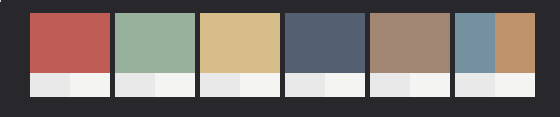
###### [sprout](colors/sprout)
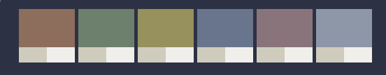
###### [raild](colors/raild)
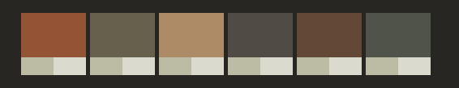
###### [tealights](colors/tealights)
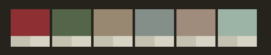
###### [traffic](colors/traffic)
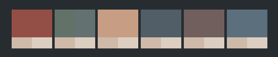
###### [prevail](colors/prevail)
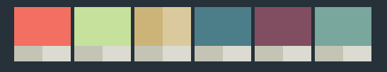
###### [blumune](colors/blumune)
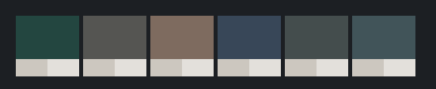
###### [soundwave](colors/soundwave)
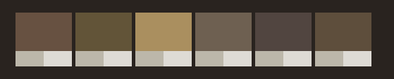
###### [coco](colors/coco)
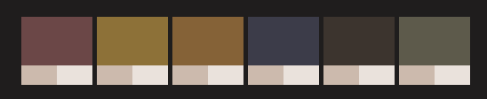
###### [blend](colors/blend)
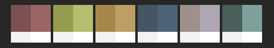
###### [link](colors/link)
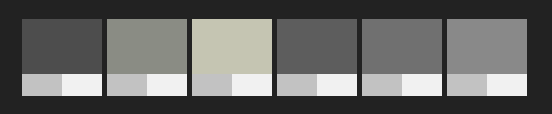
###### [view](colors/view)
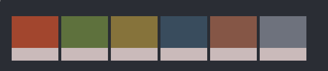
###### [kit](colors/kit)
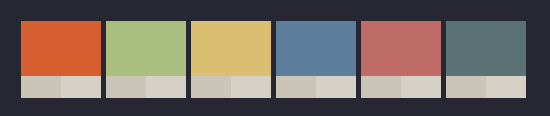
###### [corduroy](colors/corduroy)
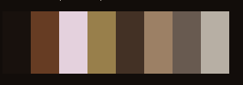
###### [shade](shade)

###### [skigh](colors/skigh)


###### [5725](colors/5725)
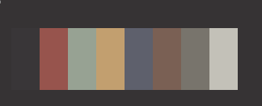

###### [flapr](colors/flapr)
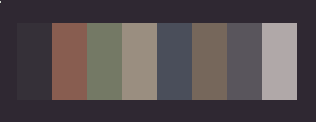

###### [brownstone](colors/brownstone)
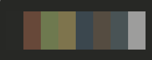
###### [slate](colors/slate)
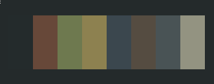

###### [vans](colors/vans)
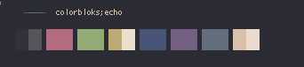

###### [fendr](colors/fendr)
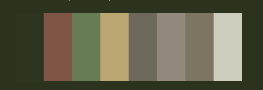

###### [owl](colors/owl)

###### [sundr](colors/sundr)


###### [chaires](colors/chaires)


###### [spire](colors/spire)

###### [urban](colors/urban)


###### [zent](colors/zent)


###### [diner](colors/diner)


###### [provrb](colors/provrb)


###### [petal](colors/petal)
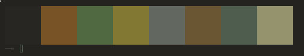

###### [paints](colors/paints)


###### [book](colors/book)


###### [parkd](colors/parkd)
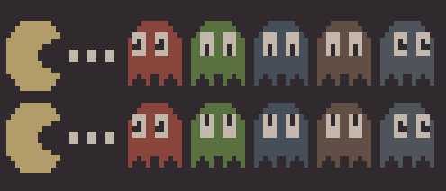

###### [relax](colors/relax)


###### [raiin](colors/raiin)


###### [bulb](colors/bulb)


###### [novembr](colors/novembr)
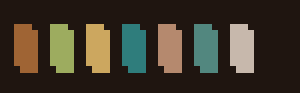

###### [branch](colors/branch)


###### [wintry](colors/wintry)


###### [escen](colors/escen)


###### [fury](colors/fury)
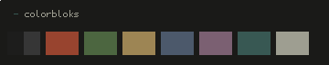

###### [squarees](colors/squarees)
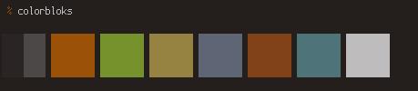

###### [harbing](colors/harbing)
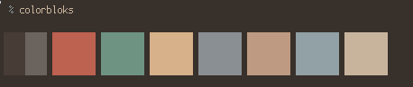

###### [poly](colors/poly)
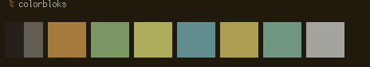

###### [victory](colors/victory)
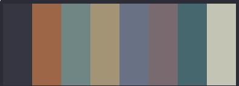

###### [bark](colors/bark)


###### [scape](colors/scape)


###### [depth](colors/depth)
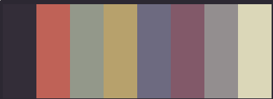

###### [scag](colors/scag)
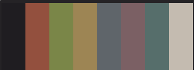

###### [leaf](colors/leaf)
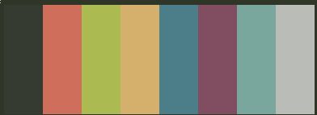

###### [designr](colors/designr)
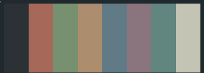

###### [mattd](colors/mattd)
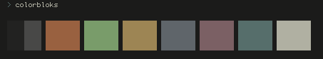

