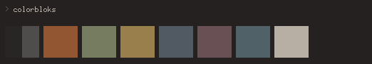

#### Colors Repo
  - You can find me on linuxbbq
  - This repo is a small subset of my colour collection for Github
  - I like to keep it simple with only 9 colors. Main reason I choose to setup my configs like this  

#### Implementation
  - Use the example from xresource file to include in .Xresources

#### Miscellaneous
  - Added tile.xbm to the repo [IIRC, I got this off of dcat's github at some point]
  - Implementation Example ` xetroot -bitmap $walls/tile.xbm -bg "$(xrdb -query | grep  "*background" | awk '{print $2}')" -fg "$(xrdb -query | grep  "*foreground" | awk '{print $2}')" `

#### Previews

###### [corduroy](corduroy)

###### [shade](shade)

###### [skigh](skigh)

###### [5725](5725)

###### [flapr](flapr)

###### [brownstone](brownstone)

###### [slate](slate)

###### [vans](vans)

###### [fendr](fendr)

###### [owl](owl)

###### [sundr](sundr)

###### [chaires](chaires)

###### [spire](spire)

###### [urban](urban)

###### [zent](zent)

###### [diner](diner)

###### [provrb](provrb)

###### [petal](petal)

###### [paints](paints)

###### [book](book)

###### [parkd](parkd)

###### [relax](relax)

###### [raiin](raiin)

###### [bulb](bulb)

###### [novembr](novembr)

###### [branch](branch)

###### [wintry](wintry)

###### [newleaf](newleaf)

###### [schredd](schredd)

###### [fury](fury)

###### [squarees](squarees)

###### [harbing](harbing)

###### [poly](poly)

###### [victory](victory)

###### [bark](bark)

###### [reloaded](reloaded)

###### [depth](depth)

###### [scag](scag)

###### [leaf](leaf)

###### [designr](designr)

###### [mattd](mattd)

